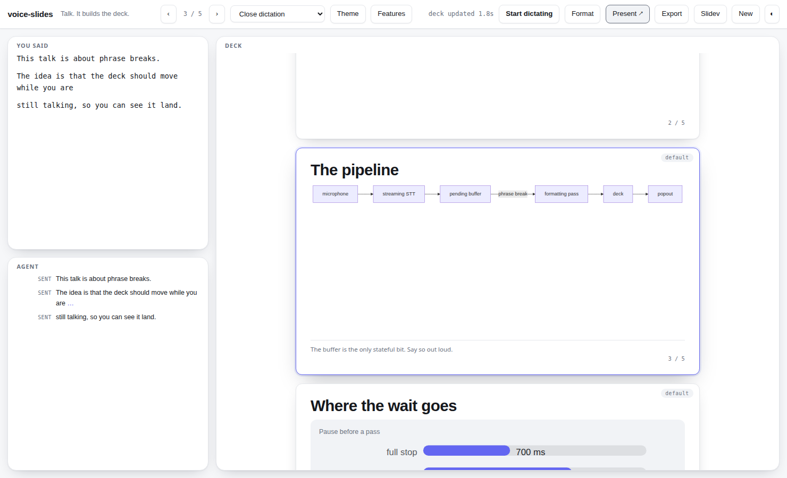
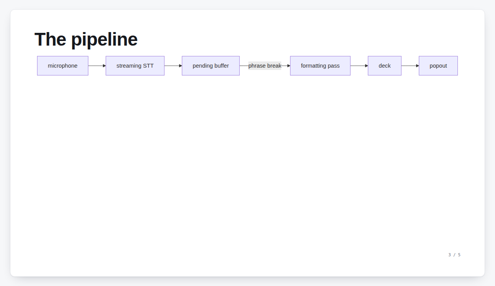
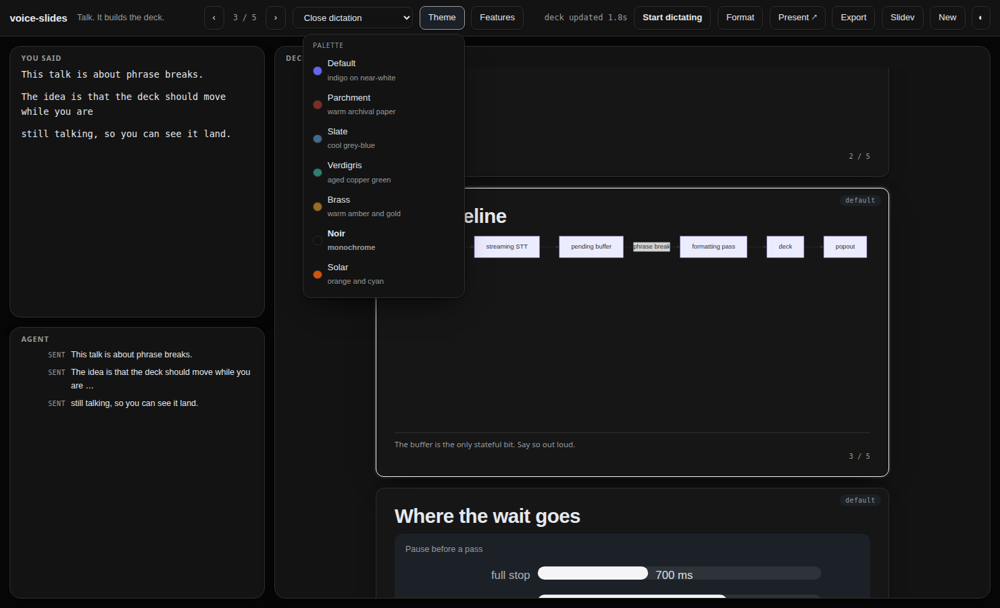
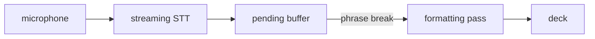
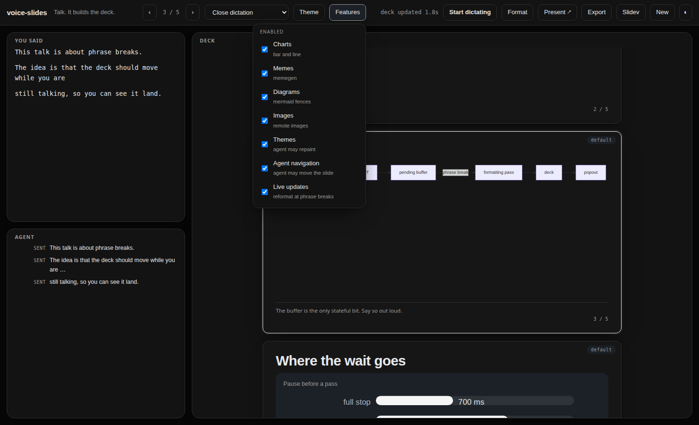

# voice-slides

Dictate a [Slidev](https://sli.dev) deck. An agent formats it while you talk.

Two pages, one Python file, one dependency. Speech goes to
heare-speech-services' streaming STT on pook; at every **phrase break** a Claude
Haiku pass folds what you just said into the running deck, so the slides move
while you are still talking. The main page is the presenter view; a popout window
shows the audience the slides and nothing else.

```
browser mic ──16kHz PCM16──▶ app.py ──▶ /stt/stream (pook)   partials ~400ms
                               │◀─────────────────────────── finals
                               │
                               ├─ phrase break (700ms) ─▶ Haiku ─▶ deck + @vs directives
                               │  ...or 4s, if you never pause
                               │
                               ├─▶ presenter view ──BroadcastChannel──▶ popout
                               └─▶ ~/.local/share/voice-slides/slides.md
```



*Left: what the room heard, and what the agent did with it. Right: every slide.
The diagram was dictated as a mermaid fence by the formatting pass.*

## Run it

```bash
uv run app.py                  # http://127.0.0.1:8097
```

`uv` reads the PEP-723 header and installs the one dependency. Plain
`python3 app.py` also works wherever `websockets>=14` is already present.

The formatting pass calls the ant-proxy on `localhost:8787`, so that service
must be up (`systemctl --user status ant-proxy`). Nothing else is needed for
auth.

Then open the page, press **Start dictating**, and talk. Pauses end an
utterance; a phrase break triggers the formatting pass.

| control | does |
|---|---|
| Start dictating / Space | toggle the mic |
| **Present ↗** | open the audience window |
| ‹ n/m › · ← → · Home/End | move the presented slide |
| modality picker | how much licence the formatting pass has — see below |
| Theme | pick a palette; the agent can also change it when you ask out loud |
| Features | which parts of the vocabulary the agent may use |
| ◐ | light / dark / follow the system, orthogonal to the palette |
| Format | run the pass immediately instead of waiting for the pause |
| Export | download the deck as `slides.md` |
| Slidev | copy `npx slidev <deck path>` |
| click a slide | present that one; the popout follows |

## The presenter view and the popout

The main page is the desk you work from: the **full captured transcript** on the
left, the **agent conversation** underneath it — what the agent was handed and
what it did with it, which is the pane you read when a slide says something you
did not say — and every slide as a card on the right.

**Present ↗** opens the audience window: one slide, full-bleed, no chrome.



The two windows sync over a `BroadcastChannel`, not over the server. The popout
has no WebSocket, no microphone, and no inference; everything it draws is already
on the origin, mermaid included. Unplug the network mid-talk and it keeps
presenting. Navigation is bidirectional — arrow keys work in either window, and
the agent can move both with `@vs goto`.

`f` goes fullscreen in the popout, `Escape` leaves it.

## Themes

Seven palettes: `default`, `parchment`, `slate`, `verdigris`, `brass`, `noir`,
`solar`. Each is a set of CSS custom properties in `static/app.css`, selected by
`data-palette` on `<html>`, with a light and a dark form — so the palette and the
◐ light/dark toggle are orthogonal, and `parchment` has a dark mode.



Pick one from the **Theme** menu, or just ask: "switch to the slate theme",
"can we get the paper one", "make it monochrome". The formatting pass maps what
you said onto an id and emits `@vs theme slate`; the presenter applies it,
persists it, and pushes it to the popout. A theme name the model invents is
dropped rather than applied, and the swatches in the menu are read back out of
the stylesheet, so the colour in the picker cannot disagree with the deck.

The ids live in `app.py` (the prompt has to be able to name them) and the
palettes live in the CSS (the popout has to render offline). `test_app.py` reads
the ids back out of the stylesheet and fails if the two drift.

## Updating while you talk

v2 waited 2.5 s of silence and then reformatted. v3 reformats at a **phrase
break**, and how long that waits depends on how your sentence ended:

| the utterance ends | wait | because |
|---|---|---|
| `…the whole mechanism.` | **0.7 s** | you landed the thought |
| `…three of them,` | 1.2 s | you are between clauses |
| `…the reason that matters is` | 1.8 s | the transcript stopped, not you |

...and a ceiling: once the oldest unformatted speech is **4 s** old the pass runs
regardless of where the sentence is, so someone who never pauses still watches
the deck move. Same for a buffer past `CLEANUP_MAX_WORDS`.

A pass that fires mid-sentence is editing a deck you have not finished talking
about, and **the model is told so**. The prompt carries a `BACKGROUND:` block —
whether you have stopped, how many words are already queued behind this pass, and
how many lookups from an earlier pass are still in flight — so it lands what it
has and leaves the edge open instead of writing a conclusion you then have to
talk it out of. The same state is on the status line (`formatting · 34w queued ·
1 lookup`) and marks the turn in the agent pane with an ellipsis.

Turning the **Live updates** feature off reverts to formatting on **Format** only.

## Modalities

The picker in the header chooses what the formatting pass is allowed to do
with what you said. A modality is a system prompt plus a tool set; there is no
other mechanism.

| modality | the pass | tools |
|---|---|---|
| **Close dictation** | near-verbatim — your sentences, your order, filler and false starts removed | none |
| **Highlights + sources** | condensed to key points, and it fetches data to back them up | `fetch_url` |
| **Spicy** | your facts, a backdrop with opinions: joke titles, sassy bullets, the odd meme | none |

In **highlights**, a claim that rests on something checkable sends the model to
`fetch_url` — a plain GET, capped at two fetches a pass, restricted to public
http(s) addresses (the resolved IP is checked, and every redirect hop is
re-checked, so a name that answers `127.0.0.1` is refused). A fetch in flight
shows as a chip in the deck pane with what it is checking, so a ten-second pass
reads as work rather than as a hang. A fetch that fails costs the model a turn,
not your deck update.

The default is close dictation; `DEFAULT_MODALITY` changes it, and the picker
remembers your last choice.

## The vocabulary

Everything the agent can ask for has a short text form. That is the point: the
model pays for every token it emits and you are standing there waiting, so
nothing is described in prose and nothing is emitted as markup. A chart is thirty
characters of label/value pairs. A theme change is four words.

The split is by destination. Anything that belongs **on a slide** is a component
tag or a fenced block inside the markdown, and travels in the deck because that
is where it renders:

```md
<Chart type="bar" title="Where the time goes" unit="ms"
       :data="[['encode', 40], ['network', 120], ['decode', 240]]" />

<Meme template="drake" top="polling the API" bottom="a websocket" />

<Figure src="https://example.org/encoder.png" caption="the encoder" />


```

Anything that is **not slide content** is a one-line `@vs` directive, stripped
out before the deck is rendered, written, or exported:

| directive | does |
|---|---|
| `@vs theme <id>` | repaint the deck in a named palette |
| `@vs goto <n>` | present slide `n`, in both windows |
| `@vs next` / `@vs prev` / `@vs first` / `@vs last` | move the presented slide |
| `@vs feature <id> <on\|off>` | turn part of this vocabulary on or off |

`app.py` validates every directive before it goes anywhere: an id that does not
exist, a slide number out of range, an invented verb — dropped, and the line is
removed either way, because whatever it says it is not slide content. A `@vs`
line inside a fenced block is content, because a deck about shell commands is
allowed to contain one.

Layouts need no new vocabulary: Slidev's own `layout:` frontmatter is already
the text form, and the preview honours it.

### How the visuals render

`<Chart>` does bar and line from `[label, value]` pairs, drawn as plain SVG —
no charting library, so the deck directory stays a self-contained artifact you
can hand to somebody rather than a project someone has to `npm i`. `<Meme>`
exists for the escaping: memegen encodes captions in the URL path with its own
scheme, which is not a thing to ask a formatting pass to get right mid-slide.
`<Figure>` takes `https` only, and rebuilds the URL from its parsed parts.

A ```` ```mermaid ```` fence renders as a diagram, from
`static/vendor/mermaid.min.js` — **vendored, not fetched**, because the
presentation window has to draw diagrams with the network unplugged. It is
loaded lazily on the first diagram, since 2.5 MB is not something a deck without
one should pay for, and it runs with `securityLevel: "strict"`: the diagram
source is model output derived from a live microphone.

Note which way round the degradation is. The container ships **with the fence
source in it** as escaped text, and mermaid replaces that afterwards. A missing
bundle, a blocked request, a diagram the speaker described too loosely to parse —
all of them land on "you can read the diagram source", without any of them being
an error path.

`<Chart>` and `<Meme>` live in `slidev/components/` as Vue SFCs and every deck
write mirrors them into `components/` beside `DECK_PATH`, which is where Slidev
auto-imports from. The live preview draws the same shapes from the same
attributes.

## Features

The **Features** menu decides which of that vocabulary is in play. A toggle is
not a renderer switch: the prompt's `AVAILABLE THIS SESSION` section is built
from the enabled set, so **a feature that is off is a feature the model was
never told exists**. There is nothing to suppress downstream.



| feature | off means |
|---|---|
| Charts / Memes / Images / Diagrams | that tag or fence is not in the prompt, and renders as nothing if one arrives anyway |
| Themes | the agent cannot repaint the deck; the picker still can |
| Agent navigation | the agent cannot move the presented slide; you still can |
| Live updates | passes run on **Format** only |

## The deck file

Every formatting pass writes the deck to `DECK_PATH`
(`~/.local/share/voice-slides/slides.md` by default), atomically. That file is
the seam between this app and Slidev proper:

```bash
npx slidev ~/.local/share/voice-slides/slides.md
```

Slidev's dev server watches the file and hot-reloads, so you get the real
renderer — themes, Shiki, click animations, presenter mode — in a second window
while you keep dictating into this one. voice-slides itself never needs Node.

## Preview vs. Slidev

The built-in preview is an approximation: slide boundaries, layouts, headings,
bullets, code, presenter notes, the component vocabulary, and mermaid diagrams.
It does not do *Slidev* themes, UnoCSS, arbitrary Vue components, click
animations, or syntax highlighting. It exists so you can see the deck's *shape*
moving while you talk, at zero dependency cost — `static/render.js` is the whole
renderer, and both views import it. When you want the real thing, point Slidev
at the file.

## Config

| env | default | |
|---|---|---|
| `BIND` / `PORT` | `127.0.0.1` / `8097` | |
| `DECK_PATH` | `~/.local/share/voice-slides/slides.md` | mirrored every pass |
| `SPEECH_URL` | `http://pook.tail5ae4b.ts.net` | |
| `SPEECH_HOST` | `heare-speech-services` | Host-header vhost; never use a raw port |
| `ANTHROPIC_BASE_URL` | `http://localhost:8787` | the ant-proxy |
| `ANTHROPIC_AUTH_TOKEN` | `proxied` | placeholder; the proxy substitutes its own bearer |
| `MODEL` | `claude-haiku-4-5-20251001` | |
| `DEFAULT_MODALITY` | `dictate` | `dictate` \| `highlights` \| `spicy` |
| `DEFAULT_THEME` | `default` | any of the seven palette ids |
| `PHRASE_PAUSE_S` | `0.7` | quiet after a finished sentence before a pass |
| `SOFT_PAUSE_S` | `1.2` | ...after a comma or a colon |
| `MIDPHRASE_PAUSE_S` | `1.8` | ...after a word nobody ends a sentence on |
| `CONTINUOUS_MAX_S` | `4.0` | pass regardless once the buffer is this old |
| `CLEANUP_MAX_WORDS` | `110` | pass anyway if the buffer gets this big |

The release number is not an env var: it is the `VERSION` file, read at
startup, reported on the socket's `config` frame and in the `x-app-version`
response header.

`CLEANUP_DEBOUNCE_S` from v2 still works; it sets `MIDPHRASE_PAUSE_S`.

Inference goes through ant-proxy on `localhost:8787`, which holds the
credential, refreshes it, and stamps the `Authorization` header on the way to
`api.anthropic.com`. This app reads no credential and holds no token. Point
`ANTHROPIC_BASE_URL` elsewhere and `ANTHROPIC_AUTH_TOKEN` becomes the real
bearer.

## The formatting prompt

`slidev-cheatsheet.md` is a condensed Slidev syntax reference (separators,
headmatter, per-slide frontmatter, layouts, notes, code blocks, click
animations). It is loaded verbatim into the system prompt on every pass, and
cached, so it is editable as a document rather than as a string literal.

`CONTRACT` in `app.py` is the rest: deck conventions, filler-stripping, and the
spoken structure commands ("new slide", "title this X", "scratch that", "add a
note") the model must obey rather than transcribe.

Two system blocks go up, and the order is the point. The cached one holds the
Slidev reference and the modality prompt, which do not move between passes; the
uncached one holds the session's theme and feature set, which do. One block would
invalidate ~2k tokens of cache every time a toggle moved.

## Tests

```bash
node test_render.mjs    # Slidev parsing, components, diagrams, directives, XSS
python3 test_app.py     # phrase breaks, the DSL, themes, the tool loop, the fetch guard
uv run test_views.py    # both views in a real browser, socket stubbed; --shots for the images
python3 test_e2e.py     # real pook STT + real Haiku via ant-proxy; needs the tailnet
```

The first three need no network and spend nothing. `test_render.mjs` imports
`static/render.js` directly — it is a module, so the code under test is the code
both pages load. `test_app.py` mocks inference at `_post`. `test_views.py` drives
the real pages in Chromium with the WebSocket stubbed in the page, feeding
fixture frames through the same seam the server uses; it **aborts and fails on
any request that leaves the origin**, which is what makes the popout's offline
claim a test rather than a claim.

Several tests exist only to catch drift between the places a fact has to be true
twice: the palette ids in `app.py` against the `data-palette` blocks in
`app.css`, the feature ids in `app.py` against the gates in `render.js`, and the
directive verbs the validator accepts against the ones the cheatsheet teaches.

## Install it on a device

Both pages are a single installable app: a manifest, icons, and a service
worker that precaches the shell, so the presenter and the popout open with the
network unplugged — the popout already presented offline, and now it launches
offline too. Add to home screen from a **secure context**; loopback counts, and
so does a `tailscale serve` hostname (the Tailscale cert is what makes it one).

### One version, and how a release lands

`VERSION` at the repo root is the only place the number is written. Every place
the browser needs it — the worker's cache name, each page's
`<meta name="app-version">`, the `?v=` stamps on `app.css`, `render.js` and
`sw-register.js`, the manifest's shortcut URL — says `__VERSION__` on disk, and
the server substitutes it on the way out. So a release is:

```bash
echo 5 > VERSION
systemctl --user restart voice-slides    # the server reads VERSION at startup
```

and for a checkout deployed from git, the whole deploy is:

```bash
git pull && systemctl --user restart voice-slides
```

What the browser then does: it re-fetches `sw.js` (entry points are served
`no-cache`), sees different bytes, installs a new worker, and **waits** — a
reload mid-talk is worse than an old deck. The page raises an *Update
available → Reload* toast; tapping it activates the waiting worker, the old
cache is deleted, and the page comes back once on the new version. An open
presenter window also re-checks on every `visibilitychange` and every 20
minutes, because one can sit open for days.

`test_app.py` covers the parts that go wrong silently: that every `PRECACHE`
path exists (`addAll` is atomic — one missing file blocks *every* future
update), that no page carries a second, literal copy of the version, and that
the entry points are served `no-cache` while the stamped assets are not.

## Install as a service

Not enabled by default.

```bash
cp voice-slides.service ~/.config/systemd/user/
systemctl --user daemon-reload
systemctl --user enable --now voice-slides
```
