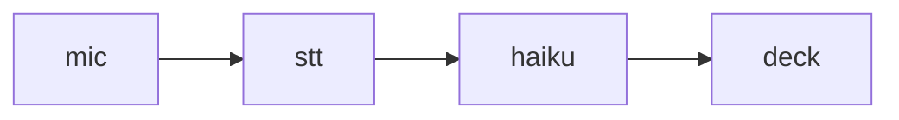

# Slidev markdown — working reference

Condensed from sli.dev (Syntax Guide, Built-in Layouts, Animations,
Customizations/headmatter) at docs version v52.19.1. This file is loaded
verbatim into the cleanup agent's system prompt; it is a working reference for
generating valid `slides.md`, not a complete manual.

## Document shape

A Slidev deck is one markdown file (`slides.md`). Slides are separated by a
line containing exactly `---`, padded by a blank line on each side.

```md
---
theme: default
title: My Talk
---

# My Talk

A subtitle line

---

# Second slide

- a bullet
- another bullet
```

## Headmatter

The first frontmatter block in the file configures the whole deck. It must be
the very first thing in the file. Useful keys (all optional; defaults shown):

```yaml
---
theme: default        # theme id / package name / local path (default, seriph, apple-basic, ...)
title: Slidev         # deck title; inferred from the first heading if omitted
info: false           # markdown string shown in the info panel
author: Your Name
keywords: a,b,c
colorSchema: auto     # auto | light | dark
aspectRatio: 16/9
canvasWidth: 980
transition: slide-left  # slide-left | slide-up | fade | fade-out | view-transition | none
lineNumbers: false    # line numbers in code blocks
drawings:
  persist: false
defaults:             # frontmatter applied to every slide
  layout: default
---
```

## Per-slide frontmatter

Every slide after the first may carry its own frontmatter, written immediately
after that slide's `---` separator and closed with another `---`:

```md
---
layout: center
class: text-center
transition: fade
---

# A centered slide
```

Common per-slide keys: `layout`, `class` (UnoCSS utility classes),
`background` (image url), `transition`, `clicks` (force the click count),
`hide: true`, `hideInToc: true`, `level` (TOC depth), `src: ./other.md`
(include another file — the slide then contains nothing else).

A slide with no frontmatter is the `default` layout.

## Built-in layouts

| layout | use |
|---|---|
| `default` | any content — the fallback |
| `cover` | deck cover: title, subtitle, context |
| `intro` | introduce the talk: title, short description, author |
| `center` | content centered in the screen |
| `section` | marks the start of a new section |
| `statement` | one affirmation as the whole slide |
| `fact` | one number or fact, very prominent |
| `quote` | a quotation, prominent |
| `two-cols` | two columns, split with `::right::` |
| `two-cols-header` | a header row, then two columns |
| `image` / `image-left` / `image-right` | needs `image: /path`; optional `backgroundSize: contain` |
| `iframe` / `iframe-left` / `iframe-right` | needs `url: https://...` |
| `full` | use the whole canvas |
| `none` | no styling at all |
| `end` | final slide |

Two-column example:

```md
---
layout: two-cols
---

# Left

This shows on the left

::right::

# Right

This shows on the right
```

## Presenter notes

The **last** HTML comment block in a slide is that slide's presenter note.
A comment that is not last is just a comment.

```md
# Slide title

Content here.

<!--
Say the thing about the latency budget here.
-->
```

Markdown inside a note is rendered.

## Code blocks

Fenced code blocks are highlighted by Shiki. Options go in `{}` after the
language:

````md
```ts {2,4-6}
// highlight lines 2 and 4-6
```

```py {all|1|2-3}{lines:true}
# step through highlights across clicks; show line numbers
```

```ts {*}{maxHeight:'200px'}
// scrollable
```
````

## Click animations

- `<v-click>text</v-click>` — appears on the next click.
- `<div v-click>text</div>` — directive form, same effect.
- `<v-after>` — appears together with the previous `v-click`.
- `.hide` modifier (`v-click.hide`) — disappears on click instead.
- `<v-clicks>` wrapping a list reveals one item per click; needs blank lines
  around the list:

```md
<v-clicks>

- Item 1
- Item 2
- Item 3

</v-clicks>
```

`<v-clicks depth="2">` also steps through nested list levels.

## Other syntax available

Plain markdown works everywhere. Also supported: LaTeX (`$inline$`, `$$block$$`),
Mermaid and PlantUML fenced blocks, raw HTML, Vue components, UnoCSS utility
classes on any element, and `<style>` blocks scoped to one slide.

## Rules that break a deck if violated

1. The headmatter must be the first block in the file, no blank line before it.
2. `---` separators need a blank line before and after, or the parser reads
   them as YAML fences / setext underlines.
3. A per-slide frontmatter block must directly follow the separator that starts
   its slide.
4. Slide content is markdown — indentation matters for lists, and a stray four
   spaces makes a code block.

## Components available in this deck

Not stock Slidev — these ship with voice-slides and are auto-imported from
`components/` beside the deck file. Both render in the live preview too.

### `<Chart>` — bar and line charts

```md
<Chart type="bar" title="Where the time goes" unit="ms"
       :data="[['encode', 40], ['network', 120], ['decode', 240]]" />

<Chart type="line" title="p99 by week"
       :data="[['w1', 820], ['w2', 610], ['w3', 430], ['w4', 400]]" />
```

- `type`: `bar` (default, compares magnitudes) or `line` (a trend over time).
- `:data`: an array of `[label, value]` pairs — note the `:` prefix, it is a
  Vue binding. Single quotes inside, double quotes outside. Max 12 pairs.
- `title`, `unit`: optional.
- Three or more numbers that compare are a chart. Two numbers are a sentence.

### `<Meme>` — an image meme

```md
<Meme template="drake" top="polling the API" bottom="a websocket" />
```

- `template`: a memegen.link template id — `drake`, `fine`, `doge`,
  `distracted-boyfriend`, `success`, `disastergirl`, `buzz`, `two-buttons`,
  `philosoraptor`, `grumpycat`, `aliens`, `bihw`, `rollsafe`.
- `top` / `bottom`: caption text as plain prose. Write it normally; the
  component does memegen's URL escaping.
- One per slide, and only where a joke earns the space.

### Diagrams

A `mermaid` fenced block works in Slidev for flowcharts and sequence diagrams.
The live preview shows it as a code block rather than a rendered diagram.

```md

```
